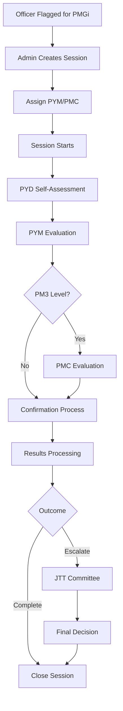

# PMGI System - Complete Developer Documentation

## Table of Contents

1. [Project Overview](#1-project-overview)
2. [System Architecture & Design Patterns](#2-system-architecture--design-patterns)
3. [Technology Stack & Dependencies](#3-technology-stack--dependencies)
4. [Environment Configuration](#4-environment-configuration)
5. [Database Architecture & Relationships](#5-database-architecture--relationships)
6. [Authentication & Authorization System](#6-authentication--authorization-system)
7. [Core Modules & Workflows](#7-core-modules--workflows)
8. [Middleware Implementation](#8-middleware-implementation)
9. [Livewire Components Deep Dive](#9-livewire-components-deep-dive)
10. [Queue System & Background Jobs](#10-queue-system--background-jobs)
11. [File Handling & Storage](#11-file-handling--storage)
12. [Email & Notification System](#12-email--notification-system)
13. [PDF & Report Generation](#13-pdf--report-generation)
14. [Frontend Implementation](#14-frontend-implementation)
15. [Security Analysis & Vulnerabilities](#15-security-analysis--vulnerabilities)
16. [Performance Optimization](#16-performance-optimization)
17. [Testing Strategy](#17-testing-strategy)
18. [Installation & Deployment](#18-installation--deployment)
19. [API Reference](#19-api-reference)
20. [Troubleshooting & Debugging](#20-troubleshooting--debugging)
21. [Code Examples & Patterns](#21-code-examples--patterns)
22. [Known Issues & Technical Debt](#22-known-issues--technical-debt)

---

## 1. Project Overview

**PMGI (Performance Management and Governance Index)** is a sophisticated web-based performance evaluation system built for TEKUN Nasional, designed to streamline the performance management process for officers across various organizational levels. The system provides a comprehensive workflow for evaluation cycles, evaluator assignments, session management, and detailed reporting.

### 1.1 System Purpose & Business Logic

The PMGI system serves as a centralized platform for:

1. **Performance Evaluation Workflow Management**
   - Multi-level evaluation process (PM1, PM2, PM3)
   - Structured evaluation forms and criteria
   - Session-based evaluation tracking
   - Result compilation and approval workflows

2. **Stakeholder Management**
   - Officer assignment and role management
   - Evaluator and facilitator appointment
   - Committee meeting coordination
   - HR oversight and intervention

3. **Reporting & Analytics**
   - Performance trend analysis
   - Monthly and cumulative reports
   - Export capabilities (Excel, PDF)
   - Visual dashboards for different user roles

4. **Notification & Communication**
   - Email notifications for all stakeholders
   - WhatsApp integration for urgent communications
   - Meeting invitations and reminders
   - Status updates and alerts

### 1.2 Key Terminology & Roles

```
Organizational Structure:
┌─────────────────────────────────────────────────────────────┐
│                        PMGI SYSTEM                          │
├─────────────────────────────────────────────────────────────┤
│  Admin Level:                                               │
│  ├── System Admin (Full Access)                             │
│  ├── HR Officers (HR Oversight & Reports)                   │
│  └── JTT Members (Committee Decisions)                      │
│                                                             │
│  Evaluation Level:                                          │
│  ├── PYD (Pegawai Dinilai) - Officer Being Evaluated        │
│  ├── PYM (Pegawai Yang Menilai) - Evaluating Officer        │
│  └── PMC (Pegawai Pemudah Cara) - Facilitating Officer      │
└─────────────────────────────────────────────────────────────┘
```

**Detailed Role Definitions:**

- **PYD (Pegawai Dinilai)**: Officer being evaluated
  - Provides self-assessment
  - Uploads supporting documents
  - Responds to evaluation feedback
  - Signs evaluation confirmation

- **PYM (Pegawai Yang Menilai)**: Primary evaluator
  - Conducts performance evaluation
  - Provides scoring and feedback
  - Required for all PMGi levels (PM1, PM2, PM3)

- **PMC (Pegawai Pemudah Cara)**: Evaluation facilitator
  - Only required for PM3 level evaluations
  - Provides additional oversight
  - Facilitates evaluation process

- **JTT (Jawatankuasa Timbang Tara)**: Arbitration committee
  - Reviews complex cases
  - Makes final decisions on disciplinary actions
  - Handles appeals and disputes

### 1.3 PMGi Evaluation Levels

The system implements a three-tier evaluation structure:

```php
// PMGi Level Structure & Timeline
$pmgiLevels = [
    'PM1' => [
        'description' => 'Basic Performance Management',
        'required_evaluators' => ['PYM'],
        'monitoring_duration' => '2 months',
        'total_timeline' => '2 months monitoring + PM1 evaluation',
        'outcomes' => ['CP1' => 'Completed Successfully']
    ],
    'PM2' => [
        'description' => 'Intermediate Performance Management', 
        'required_evaluators' => ['PYM'],
        'monitoring_duration' => '2 months',
        'total_timeline' => '2 months monitoring + PM2 evaluation',
        'outcomes' => ['CP2' => 'Completed Successfully']
    ],
    'PM3' => [
        'description' => 'Advanced Performance Management',
        'required_evaluators' => ['PYM', 'PMC'],
        'monitoring_duration' => '2 months',
        'total_timeline' => '2 months monitoring + PM3 evaluation',
        'outcomes' => [
            'PEX' => 'Recommend Termination Without Conditions',
            'EXC' => 'Recommend Termination With Conditions', 
            'EXP' => 'Suspend Recommendation',
            'NEX' => 'Escalate to JTT Committee'
        ]
    ]
];

// PMGi Timeline Flow Example
$timelineExample = [
    'Month 1-2 (Jan-Feb)' => 'Initial 2-month monitoring period',
    'Month 3 (Mar)' => 'If fails monitoring → Enter PM1',
    'Month 4-5 (Apr-May)' => '2-month monitoring during PM1',
    'Month 6 (Jun)' => 'If fails PM1 → Enter PM2', 
    'Month 7-8 (Jul-Aug)' => '2-month monitoring during PM2',
    'Month 9 (Sep)' => 'If fails PM2 → Enter PM3',
    'Month 10-11 (Oct-Nov)' => '2-month monitoring during PM3',
    'Month 12 (Dec)' => 'PM3 evaluation → Final outcome or JTT escalation'
];
```

### 1.4 System Workflow Overview



---

## 2. System Architecture & Design Patterns

### 2.1 High-Level Architecture

The PMGI system follows a modular, layered architecture built on Laravel's MVC pattern enhanced with Livewire components for reactive frontend interactions.

```
┌─────────────────────────────────────────────────────────────┐
│                     PRESENTATION LAYER                      │
├─────────────────────────────────────────────────────────────┤
│  Web Browser (TailwindCSS + Alpine.js + Livewire)           │
│  ├── Dashboards (Role-based UI)                             │
│  ├── Forms & Validation (Livewire Components)               │
│  ├── Real-time Updates (Livewire Events)                    │
│  └── File Uploads (Livewire WithFileUploads)                │
└─────────────────────────────────────────────────────────────┘
                              │
┌─────────────────────────────────────────────────────────────┐
│                    APPLICATION LAYER                        │
├─────────────────────────────────────────────────────────────┤
│  Laravel 11 Framework                                       │
│  ├── Livewire Components (app/Livewire/)                    │
│  ├── HTTP Controllers (app/Http/Controllers/)               │
│  ├── Middleware (Authentication, Authorization, Session)    │
│  ├── Services (Business Logic)                              │
│  ├── Jobs (Queue Processing)                                │
│  └── Console Commands (Artisan Commands)                    │
└─────────────────────────────────────────────────────────────┘
                              │
┌─────────────────────────────────────────────────────────────┐
│                     DOMAIN LAYER                            │
├─────────────────────────────────────────────────────────────┤
│  Models & Business Logic                                    │
│  ├── Eloquent Models (app/Models/)                          │
│  ├── Relationships & Scopes                                 │
│  ├── Validation Rules                                       │
│  ├── Custom Collections                                     │ 
│  └── Model Events & Observers                               │
└─────────────────────────────────────────────────────────────┘
                              │
┌─────────────────────────────────────────────────────────────┐
│                 INFRASTRUCTURE LAYER                        │
├─────────────────────────────────────────────────────────────┤
│  External Systems & Storage                                 │
│  ├── MSSQL Database (Primary)                               │
│  ├── Laravel Queue Tables                                   │
│  ├── File Storage (Local/Cloud)                             │
│  ├── Email Services (SMTP)                                  │
│  ├── WhatsApp API (WABLAS)                                  │
│  └── External HTML→Image Service                            │
└─────────────────────────────────────────────────────────────┘
```

### 2.2 Directory Structure & Organization

```
app/
├── Console/Commands/              # Artisan Commands
│   ├── ConvertHtmlToImage.php    # HTML→Image conversion
│   ├── ImportHrOfficerData.php   # HR data synchronization
│   └── CreateServiceCommand.php   # Service generators
├── Http/
│   ├── Controllers/               # Traditional controllers
│   │   ├── Auth/                 # Authentication controllers
│   │   └── SearchController.php  # AJAX search endpoints
│   └── Middleware/               # Custom middleware
│       ├── CheckUserAccess.php   # Page-level authorization
│       ├── CheckUserRole.php     # Role-based access
│       ├── EnsureHasSession.php  # Session validation
│       └── RestrictDuringSession.php # Session flow control
├── Livewire/                     # Livewire Components
│   ├── Auth/                     # Authentication components
│   ├── Home/                     # Dashboard components
│   ├── Module/                   # Core feature modules
│   │   ├── Hr/                   # HR management
│   │   ├── Jtt/                  # Committee management
│   │   ├── Lantikan/             # Appointment management
│   │   ├── Prestasi/             # Performance reporting
│   │   └── Tetapan/              # System configuration
│   └── LoadingPmgi.php           # Session loading states
├── Models/                       # Eloquent Models
│   ├── User.php                  # User authentication
│   ├── SessionInfo.php           # Session management
│   ├── SettPymPmc.php            # PYM/PMC assignments
│   ├── MntrSession.php           # Session monitoring
│   └── [40+ specialized models]
├── Jobs/                         # Queue jobs
│   ├── SendJttHrEmail.php        # Email notifications
│   ├── CleanupTemporaryFiles.php # File cleanup
│   └── [4 other notification jobs]
├── Services/                     # Business logic services
│   ├── General/LoginService.php  # Authentication logic
│   └── HtmlToImageService.php    # Image generation
└── helpers.php                   # Global helper functions
```

### 2.3 Design Patterns Implementation

#### 2.3.1 Repository Pattern (Implicit via Eloquent)

```php
// Example: Session repository pattern through Eloquent
class SessionInfo extends Model
{
    protected $table = "pmgi_session_info";
    protected $guarded = [];
    public $timestamps = false;

    // Relationship definitions
    public function setting()
    {
        return $this->belongsTo(SettPymPmc::class, 'session_id', 'session_id');
    }

    public function pydInfo()
    {
        return $this->hasOne(SessionPydInfo::class, 'session_id', 'session_id');
    }
}

// Usage in Livewire components
$session = SessionInfo::whereDate('session_date', now())
    ->where('status', 0)
    ->whereHas('setting', function ($query) use ($user) {
        $query->where('pyd_id', $user->userid);
    })
    ->first();
```

#### 2.3.2 Service Layer Pattern

```php
// HtmlToImageService.php - Encapsulates complex business logic
class HtmlToImageService
{
    public function generate(string $view, array $viewData, string $directory, string $fileName): array
    {
        try {
            // Generate HTML from Blade view
            $htmlContent = view($view, $viewData)->render();
            
            // Define file paths
            $directoryPath = storage_path('app/public/' . $directory);
            $htmlPath = $directoryPath . $fileName . '.html';
            $imagePath = $directoryPath . $fileName . '.png';
            
            // Create directory if needed
            if (!file_exists($directoryPath)) {
                mkdir($directoryPath, 0777, true);
            }
            
            // Save HTML content
            file_put_contents($htmlPath, $htmlContent);
            
            // Convert to image using Artisan command
            $exitCode = Artisan::call('convert:html-to-image', [
                'htmlPath' => $htmlPath,
                'imagePath' => $imagePath,
                '--quality' => 85,
                '--format' => 'png'
            ]);
            
            return ['html' => $htmlPath, 'image' => $imagePath];
        } catch (Exception $e) {
            Log::error('HtmlToImageService error: ' . $e->getMessage());
            throw $e;
        }
    }
}
```

#### 2.3.3 Observer Pattern (Livewire Events)

```php
// Event-driven architecture for real-time updates
class LoadingPmgi extends Component
{
    protected $listeners = ['sessionUpdated' => 'checkRecord'];
    
    public function checkRecord()
    {
        $pmgiLevel = substr($this->sessionId, 3, 1);
        
        if ($pmgiLevel != 3) {
            $pydRecordExists = SessionPydInfo::where('session_id', $this->sessionId)->exists();
            $pymRecordExists = SessionPymInfo::where('session_id', $this->sessionId)->exists();
            
            if ($pydRecordExists && $pymRecordExists) {
                $encodedSessionId = str_replace('/', '-', $this->sessionId);
                return $this->redirect('/perakuan?session_id='.$encodedSessionId.'&source='.$this->source);
            }
        }
        // ... PM3 logic
    }
}
```

#### 2.3.4 Strategy Pattern (Role-based Components)

```php
// Abstract base for different PMGi levels
abstract class BasePmgi extends Component
{
    use Actions;
    
    // Template method pattern
    public function showSelection($pmgi)
    {
        if (count($this->selection) == 0) {
            $this->emptySelection();
        } else {
            if ($this->getPmgiLevel() == 'PM3') {
                $this->getPymPmc();  // Strategy for PM3
            } else {
                $this->getPym();     // Strategy for PM1/PM2
            }
            $this->pmgi = $pmgi;
            $this->cardModal = true;
        }
    }
    
    // Strategy method - implemented by concrete classes
    abstract protected function getPmgiLevel(): string;
}

// Concrete strategies
class Pmgi1 extends BasePmgi
{
    protected function getPmgiLevel(): string
    {
        return 'PM1';
    }
}

class Pmgi3 extends BasePmgi
{
    protected function getPmgiLevel(): string
    {
        return 'PM3';
    }
}
```

### 2.4 Component Communication Architecture

```php
// Parent-Child Component Communication
class Home extends Component
{
    public function mount()
    {
        // Handle flash messages from middleware
        if (session()->has('flash_error')) {
            $this->dialog()->error(
                $title = 'Perhatian.',
                $description = session('flash_error')
            );
        }
    }
}

// Cross-component event emission
class PegawaiDinilai extends Component
{
    public function submit()
    {
        $this->validate();
        
        SessionPydInfo::create([
            'session_id' => $this->sessionId,
            'problem' => $this->problem,
            'reason' => $this->reason,
            // ... other fields
        ]);
        
        // Emit event for other components
        $this->emit('sessionUpdated', $this->sessionId);
        
        return $this->redirect('/loading-pmgi?session_id=' . $sessionId . '&source=pyd');
    }
}
```

---

## 3. Technology Stack & Dependencies

### 3.1 Core Framework Stack

#### PHP & Laravel Foundation
```json
{
    "require": {
        "php": "^8.2",
        "laravel/framework": "^11.0",
        "laravel/tinker": "^2.9"
    }
}
```

**PHP 8.2 Features Utilized:**
- **Typed Properties**: Extensive use in Livewire components
- **Union Types**: Model relationship type hinting
- **Match Expressions**: Used in result mapping logic
- **Enums**: For PMGi result codes (implementation opportunity)

```php
// Example of PHP 8.2 features in use
class PegawaiDinilai extends Component
{
    // Typed properties
    public string $sessionId;
    public int $problem;
    public ?string $attachment = null;
    
    // Union types in methods
    public function processFile(): string|null
    {
        if ($this->file) {
            // File processing logic
            return $db_path;
        }
        return null;
    }
}
```

#### Laravel 11 Specific Features
- **Simplified Application Structure**: Streamlined bootstrap process
- **Per-second Rate Limiting**: Used in API endpoints
- **Improved Artisan Commands**: Custom commands for HTML conversion
- **Enhanced Middleware**: Advanced session management

### 3.2 Frontend Technology Stack

#### TALL Stack Implementation
```
T - TailwindCSS ^3.4  (Utility-first CSS)
A - Alpine.js ^3.13   (Lightweight JS framework)  
L - Laravel ^11.0     (Backend framework)
L - Livewire ^3.4     (Full-stack reactive components)
```

**TailwindCSS Configuration:**
```javascript
// tailwind.config.js
module.exports = {
    content: [
        "./resources/**/*.blade.php",
        "./resources/**/*.js",
        "./app/Livewire/**/*.php",
        "./vendor/wireui/wireui/src/*.php",
        "./vendor/wireui/wireui/ts/**/*.ts"
    ],
    theme: {
        extend: {
            colors: {
                primary: {
                    50: '#eff6ff',
                    600: '#2563eb',
                    700: '#1d4ed8',
                    800: '#1e40af',
                    900: '#1e3a8a'
                }
            }
        }
    },
    plugins: [
        require('@tailwindcss/forms'),
        require('@tailwindcss/typography')
    ]
}
```

**Alpine.js Integration Examples:**
```html
<!-- Complex state management in PMGi records -->
<div x-data="{
    tab: 'PM1',
    pmgiData: {{ json_encode($pmgiData) }},
    activePmgi: {},
    pmgiSessionIds: { PM1: null, PM2: null, PM3: null },
    
    setActivePmgi(lvl) {
        this.tab = lvl;
        this.activePmgi = this.pmgiData.find(pmgi => pmgi.lvl === lvl) || {};
        this.pmgiSessionIds[lvl] = this.activePmgi.session_id;
    },
    
    init() {
        this.pmgiData.forEach(pmgi => {
            this.pmgiSessionIds[pmgi.lvl] = pmgi.session_id;
        });
        this.setActivePmgi('PM1');
    }
}" x-init="init()">
    <!-- Tab interface implementation -->
</div>
```

#### WireUI Component Library
```php
// composer.json
"wireui/wireui": "^1.19"

// Component usage examples
class Login extends Component
{
    use Actions; // WireUI traits
    
    public function authenticate()
    {
        // WireUI dialog integration
        $this->dialog()->error(
            $title = 'Perhatian.',
            $description = 'Authentication failed'
        );
    }
}
```

### 3.3 Database & Storage Technologies

#### MSSQL Database Integration
```php
// config/database.php - SQL Server configuration
'sqlsrv' => [
    'driver' => 'sqlsrv',
    'url' => env('DATABASE_URL'),
    'host' => env('DB_HOST', 'localhost'),
    'port' => env('DB_PORT', '1433'),
    'database' => env('DB_DATABASE', 'pmgi'),
    'username' => env('DB_USERNAME', 'sa'),
    'password' => env('DB_PASSWORD', ''),
    'charset' => 'utf8',
    'prefix' => '',
    'prefix_indexes' => true,
    'encrypt' => env('DB_ENCRYPT', 'yes'),
    'trust_server_certificate' => env('DB_TRUST_SERVER_CERTIFICATE', 'false'),
    'options' => [
        PDO::ATTR_STRINGIFY_FETCHES => false,
        PDO::SQLSRV_ATTR_ENCODING => PDO::SQLSRV_ENCODING_UTF8,
    ],
];

// Custom MSSQL stored procedure execution
class DB
{
    public static function executeProcedure($procedureName, $bindings = [])
    {
        // Execute stored procedure with parameters
        $placeholders = [];
        
        if (!empty($bindings)) {
            foreach ($bindings as $key => $value) {
                $placeholders[] = '?';
            }
            $sql = "EXEC $procedureName " . implode(', ', $placeholders);
            return DB::select($sql, array_values($bindings));
        } else {
            return DB::select("EXEC $procedureName");
        }
    }
    
    // Example stored procedure calls
    public static function getPmgiSessionData($sessionId)
    {
        return self::executeProcedure('sp_get_pmgi_session', [$sessionId]);
    }
    
    public static function updatePmgiEvaluation($sessionId, $evaluation, $status)
    {
        return self::executeProcedure('sp_update_pmgi_evaluation', [
            $sessionId, $evaluation, $status
        ]);
    }
}
```

#### File Storage Architecture
```php
// config/filesystems.php
'disks' => [
    'local' => [
        'driver' => 'local',
        'root' => storage_path('app'),
        'throw' => false,
    ],
    'public' => [
        'driver' => 'local',
        'root' => storage_path('app/public'),
        'url' => env('APP_URL').'/storage',
        'visibility' => 'public',
        'throw' => false,
    ],
    'ftp' => [
        'driver' => 'ftp',
        'host' => env('FTP_HOST', 'ftp.example.com'),
        'username' => env('FTP_USERNAME', 'ftp_username'),
        'password' => env('FTP_PASSWORD', 'ftp_password'),
        'port' => env('FTP_PORT', 21),
        'root' => env('FTP_ROOT', '/'),
    ]
]
```

### 3.4 Queue & Job Processing

#### Laravel Queue Configuration
```php
// config/queue.php
'connections' => [
    'database' => [
        'driver' => 'database',
        'connection' => env('DB_QUEUE_CONNECTION'),
        'table' => env('DB_QUEUE_TABLE', 'pmgi_jobs'),
        'queue' => env('DB_QUEUE', 'default'),
        'retry_after' => (int) env('DB_QUEUE_RETRY_AFTER', 90),
        'after_commit' => false,
    ]
]

// Job implementation example
class SendJttHrEmail implements ShouldQueue
{
    use Dispatchable, InteractsWithQueue, Queueable, SerializesModels;
    
    protected $email;
    protected $imagePath;
    protected $reportPaths;
    
    public function __construct($email, $imagePath, array $reportPaths)
    {
        $this->email = $email;
        $this->imagePath = $imagePath;
        $this->reportPaths = $reportPaths;
    }
    
    public function handle(): void
    {
        Mail::to($this->email)
            ->send(new JttHr($this->imagePath, $this->reportPaths));
    }
}
```

### 3.5 External Service Dependencies

#### Document Processing Dependencies
```json
{
    "require": {
        "barryvdh/laravel-dompdf": "^3.0",
        "maatwebsite/excel": "^3.1"
    }
}
```

**PDF Generation Implementation:**
```php
use Barryvdh\DomPDF\Facade\Pdf;

class RekodPmgi extends Component
{
    public function streamRekodPmgi($sessionId)
    {
        $sessionId = str_replace('-', '/', $sessionId);
        $data = $this->prepareReportData($sessionId);
        
        $pdf = Pdf::loadView('pdf.borang_jpoc', $data)
            ->setPaper('a4', 'portrait')
            ->setOptions([
                'defaultFont' => 'sans-serif',
                'isHtml5ParserEnabled' => true,
                'isRemoteEnabled' => true
            ]);
            
        return response()->streamDownload(
            fn () => print($pdf->output()),
            "rekod-pmgi-{$sessionId}.pdf",
            ['Content-Type' => 'application/pdf']
        );
    }
}
```

#### WhatsApp Integration (WABLAS API)
```php
// config/app.php custom configuration
'wablas_api_url' => env('WABLAS_API_URL', ''),
'wablas_api_token' => env('WABLAS_API_TOKEN', ''),
'wablas_api_secret_key' => env('WABLAS_API_SECRET_KEY', ''),

// WhatsApp service implementation
class Whatsapp
{
    private $apiUrl;
    private $apiToken;
    
    public function __construct()
    {
        $this->apiUrl = config('app.wablas_api_url');
        $this->apiToken = config('app.wablas_api_token');
    }
    
    public function sendMessage($phoneNumber, $message)
    {
        $endpoint = $this->apiUrl . '/api/send-message';
        
        $payload = [
            'phone' => $phoneNumber,
            'message' => $message,
            'token' => $this->apiToken
        ];
        
        return Http::post($endpoint, $payload);
    }
}
```

### 3.6 Development & Testing Tools

#### Laravel Debugbar Integration
```php
// composer.json (dev dependency)
"require-dev": {
    "barryvdh/laravel-debugbar": "^3.13"
}

// Usage in development
if (app()->environment('local')) {
    // Debugbar automatically enabled
    // Shows queries, routes, views, mail, etc.
}
```

#### Pest Testing Framework
```php
// composer.json
"require-dev": {
    "pestphp/pest": "^2.34",
    "pestphp/pest-plugin-laravel": "^2.4"
}

// Example test structure
it('can authenticate user with valid credentials', function () {
    $user = User::factory()->create([
        'userid' => 'TEST1234',
        'userstatus' => 1
    ]);
    
    $response = $this->post('/login', [
        'userId' => 'TEST1234',
        'password' => 'password123'
    ]);
    
    $response->assertRedirect('/home');
    $this->assertAuthenticatedAs($user);
});
```

#### Laravel Pint Code Formatting
```json
// pint.json configuration
{
    "preset": "laravel",
    "rules": {
        "simplified_null_return": true,
        "not_operator_with_successor_space": true,
        "ordered_imports": {
            "sort_algorithm": "alpha"
        }
    }
}
```

---

## 4. Environment Configuration

### 4.1 Environment Variables Reference

The PMGI system requires extensive environment configuration for proper operation. Below is a comprehensive guide to all environment variables used:

```bash
# Application Configuration
APP_NAME=PMGI
APP_ENV=production
APP_KEY=base64:your-32-character-key
APP_DEBUG=false
APP_TIMEZONE=Asia/Kuala_Lumpur
APP_URL=https://pmgi.tekun.gov.my
APP_LOCALE=en
APP_FALLBACK_LOCALE=en

# Database Configuration (MSSQL)
DB_CONNECTION=sqlsrv
DB_HOST=your-mssql-server
DB_PORT=1433
DB_DATABASE=your-database-name
DB_SERVICE_NAME=your-service-name
DB_USERNAME=your-username
DB_PASSWORD=your-password
DB_CHARSET=AL32UTF8
DB_PREFIX=
DB_SCHEMA_PREFIX=
DB_TNS=your-tns-entry

# Queue Configuration
QUEUE_CONNECTION=database
DB_QUEUE_TABLE=pmgi_jobs
DB_QUEUE_RETRY_AFTER=90

# Mail Configuration
MAIL_MAILER=smtp
MAIL_HOST=your-smtp-server
MAIL_PORT=587
MAIL_USERNAME=your-email@tekun.gov.my
MAIL_PASSWORD=your-email-password
MAIL_ENCRYPTION=tls
MAIL_FROM_ADDRESS=noreply@tekun.gov.my
MAIL_FROM_NAME="PMGI System"

# WhatsApp Integration (WABLAS)
WABLAS_API_URL=https://api.wablas.com
WABLAS_API_TOKEN=your-wablas-token
WABLAS_API_SECRET_KEY=your-secret-key

# File Storage
FILESYSTEM_DISK=local
FTP_HOST=your-ftp-server
FTP_USERNAME=your-ftp-username
FTP_PASSWORD=your-ftp-password
FTP_PORT=21
FTP_ROOT=/

# Session Configuration
SESSION_DRIVER=database
SESSION_LIFETIME=480
SESSION_ENCRYPT=false
SESSION_EXPIRE_ON_CLOSE=false

# Cache Configuration
CACHE_DRIVER=database
CACHE_PREFIX=pmgi

# Authentication
AUTH_GUARD=web
AUTH_PASSWORD_TIMEOUT=10800
```

### 4.2 Server Requirements

#### Minimum System Requirements
```yaml
Operating System: Windows Server 2019+ / Linux Ubuntu 20.04+
PHP Version: 8.2+
Memory: 4GB RAM minimum, 8GB recommended
Storage: 50GB minimum, 100GB+ recommended
Database: Microsoft SQL Server 2016+ or SQL Server 2019+ recommended

Required PHP Extensions:
  - BCMath
  - Ctype
  - Fileinfo
  - JSON
  - Mbstring
  - OpenSSL
  - PDO
  - PDO_SQLSRV (MSSQL)
  - Tokenizer
  - XML
  - cURL
  - GD or Imagick
  - Zip
```

#### External Tool Dependencies
```bash
# wkhtmltopdf for HTML to Image conversion
# Windows Installation:
Download from: https://wkhtmltopdf.org/downloads.html
Install to: C:\Program Files\wkhtmltopdf\bin\wkhtmltoimage.exe

# Linux Installation:
sudo apt-get install wkhtmltopdf

# Verify installation:
wkhtmltoimage --version
```

### 4.3 Production Configuration

#### Web Server Configuration (Apache/Nginx)

**Apache (.htaccess already included):**
```apache
<IfModule mod_rewrite.c>
    <IfModule mod_negotiation.c>
        Options -MultiViews -Indexes
    </IfModule>

    RewriteEngine On
    
    # Handle Authorization Header
    RewriteCond %{HTTP:Authorization} .
    RewriteRule .* - [E=HTTP_AUTHORIZATION:%{HTTP:Authorization}]
    
    # Redirect Trailing Slashes If Not A Folder...
    RewriteCond %{REQUEST_FILENAME} !-d
    RewriteCond %{REQUEST_URI} (.+)/$
    RewriteRule ^ %1 [L,R=301]
    
    # Send Requests To Front Controller...
    RewriteCond %{REQUEST_FILENAME} !-d
    RewriteCond %{REQUEST_FILENAME} !-f
    RewriteRule ^ index.php [L]
</IfModule>
```

**Nginx Configuration:**
```nginx
server {
    listen 80;
    server_name pmgi.tekun.gov.my;
    root /var/www/pmgi/public;
    
    add_header X-Frame-Options "SAMEORIGIN";
    add_header X-Content-Type-Options "nosniff";
    
    index index.php;
    
    charset utf-8;
    
    location / {
        try_files $uri $uri/ /index.php?$query_string;
    }
    
    location = /favicon.ico { access_log off; log_not_found off; }
    location = /robots.txt  { access_log off; log_not_found off; }
    
    error_page 404 /index.php;
    
    location ~ \.php$ {
        fastcgi_pass unix:/var/run/php/php8.2-fpm.sock;
        fastcgi_param SCRIPT_FILENAME $realpath_root$fastcgi_script_name;
        include fastcgi_params;
    }
    
    location ~ /\.(?!well-known).* {
        deny all;
    }
}
```

### 4.4 Development Environment Setup

#### Docker Configuration (Optional)
```dockerfile
# Dockerfile
FROM php:8.2-fpm

# Install system dependencies
RUN apt-get update && apt-get install -y \
    git \
    curl \
    libpng-dev \
    libonig-dev \
    libxml2-dev \
    zip \
    unzip \
    libaio1 \
    wget

# Install PHP extensions
RUN docker-php-ext-install pdo_mysql mbstring exif pcntl bcmath gd

# Install MSSQL drivers
RUN apt-get update && apt-get install -y \
    curl apt-transport-https gnupg lsb-release \
&& curl https://packages.microsoft.com/keys/microsoft.asc | gpg --dearmor > microsoft.gpg \
&& mv microsoft.gpg /etc/apt/trusted.gpg.d/microsoft.gpg \
&& echo "deb [arch=amd64] https://packages.microsoft.com/repos/microsoft-ubuntu-$(lsb_release -rs)-prod $(lsb_release -cs) main" > /etc/apt/sources.list.d/dotnetdev.list \
&& apt-get update \
&& ACCEPT_EULA=Y apt-get install -y msodbcsql18 mssql-tools18 unixodbc-dev \
&& echo 'export PATH="$PATH:/opt/mssql-tools18/bin"' >> ~/.bashrc

# Install Composer
COPY --from=composer:latest /usr/bin/composer /usr/bin/composer

# Set working directory
WORKDIR /var/www

# Copy application code
COPY . .

# Install dependencies
RUN composer install --optimize-autoloader --no-dev

# Set permissions
RUN chown -R www-data:www-data /var/www \
    && chmod -R 755 /var/www/storage
```

---

## 5. Database Architecture & Relationships

### 5.1 Core Database Tables

The PMGI system utilizes a Microsoft SQL Server database with over 30 interconnected tables. Here's the comprehensive structure:

#### 5.1.1 Authentication & User Management
```sql
-- Primary user table (external system)
CREATE TABLE fms_users (
    userid VARCHAR2(20) PRIMARY KEY,
    username VARCHAR2(100) NOT NULL,
    userpassword VARCHAR2(500), -- Encrypted
    userstatus NUMBER(1) DEFAULT 1, -- 1=Active, 0=Inactive
    encryptflag NUMBER(1) DEFAULT 1 -- Encryption method flag
);

-- Officer details
CREATE TABLE bank_officer (
    officer_id VARCHAR2(20) PRIMARY KEY,
    officer_name VARCHAR2(200) NOT NULL,
    staffno VARCHAR2(20),
    nokp VARCHAR2(20), -- IC number
    officer_position VARCHAR2(100),
    branch_code VARCHAR2(10),
    FOREIGN KEY (officer_id) REFERENCES fms_users(userid)
);

-- Branch information
CREATE TABLE branch (
    branch_code VARCHAR2(10) PRIMARY KEY,
    branch_name VARCHAR2(200) NOT NULL,
    branch_type VARCHAR2(50),
    state_code VARCHAR2(5),
    FOREIGN KEY (state_code) REFERENCES bnm_statecode(code)
);
```

#### 5.1.2 Session Management Tables
```sql
-- Main session information
CREATE TABLE pmgi_session_info (
    session_id VARCHAR2(50) PRIMARY KEY,
    session_date DATE NOT NULL,
    status NUMBER(1) DEFAULT 0, -- 0=Active, 1=Completed
    created_at DATE DEFAULT SYSDATE,
    updated_at DATE
);

-- PYM/PMC assignment settings
CREATE TABLE pmgi_sett_pym_pmc (
    id NUMBER GENERATED ALWAYS AS IDENTITY PRIMARY KEY,
    session_id VARCHAR2(50) NOT NULL,
    pyd_id VARCHAR2(20) NOT NULL, -- Officer being evaluated
    pym_id VARCHAR2(20) NOT NULL, -- Evaluating officer
    pmc_id VARCHAR2(20), -- Facilitating officer (PM3 only)
    pmgi_level VARCHAR2(10) NOT NULL, -- PM1, PM2, PM3
    report_date DATE NOT NULL,
    created_at DATE DEFAULT SYSDATE,
    updated_at DATE,
    FOREIGN KEY (session_id) REFERENCES pmgi_session_info(session_id),
    FOREIGN KEY (pyd_id) REFERENCES fms_users(userid),
    FOREIGN KEY (pym_id) REFERENCES fms_users(userid),
    FOREIGN KEY (pmc_id) REFERENCES fms_users(userid)
);

-- Session evaluation data - PYD responses
CREATE TABLE session_pyd_info (
    id NUMBER GENERATED ALWAYS AS IDENTITY PRIMARY KEY,
    session_id VARCHAR2(50) NOT NULL,
    problem NUMBER(2), -- Problem category
    reason CLOB, -- Root cause analysis
    action CLOB, -- Action plan
    comments CLOB, -- Additional comments
    attachment VARCHAR2(500), -- File path
    date_signed DATE,
    created_by VARCHAR2(20),
    created_at DATE DEFAULT SYSDATE,
    FOREIGN KEY (session_id) REFERENCES pmgi_session_info(session_id)
);

-- Session evaluation data - PYM responses  
CREATE TABLE session_pym_info (
    id NUMBER GENERATED ALWAYS AS IDENTITY PRIMARY KEY,
    session_id VARCHAR2(50) NOT NULL,
    performance_score NUMBER(3,2), -- Performance rating
    comments CLOB,
    recommendations CLOB,
    date_signed DATE,
    created_by VARCHAR2(20),
    created_at DATE DEFAULT SYSDATE,
    FOREIGN KEY (session_id) REFERENCES pmgi_session_info(session_id)
);

-- Session evaluation data - PMC responses (PM3 only)
CREATE TABLE session_pmc_info (
    id NUMBER GENERATED ALWAYS AS IDENTITY PRIMARY KEY,
    session_id VARCHAR2(50) NOT NULL,
    exit_flag NUMBER(1) DEFAULT 0, -- 0=Continue, 1=Exit recommended
    exit_type_flag NUMBER(1), -- 1=Unconditional, 2=Conditional, 3=Suspended
    facilitation_notes CLOB,
    final_recommendation CLOB,
    date_signed DATE,
    created_by VARCHAR2(20),
    created_at DATE DEFAULT SYSDATE,
    FOREIGN KEY (session_id) REFERENCES pmgi_session_info(session_id)
);
```

#### 5.1.3 Performance Monitoring
```sql
-- Performance monitoring session data
CREATE TABLE pmgi_mntr_session (
    report_date DATE NOT NULL,
    state_code VARCHAR2(5) NOT NULL,
    branch_code VARCHAR2(10) NOT NULL,
    officer_id VARCHAR2(20) NOT NULL,
    pmgi_level VARCHAR2(10), -- Current PMGi level
    pmgi_cycle NUMBER(2), -- Evaluation cycle
    pmgi_result VARCHAR2(10), -- Outcome code
    pmgi_wq CHAR(1) DEFAULT 'N', -- Waiting queue flag
    seq_no NUMBER(3), -- Sequence number
    PRIMARY KEY (report_date, state_code, branch_code, officer_id)
);

-- Monthly performance summary
CREATE TABLE pmgi_summ_mth_officer (
    officer_id VARCHAR2(20) NOT NULL,
    report_date DATE NOT NULL,
    branch_state_code VARCHAR2(5),
    acct_branch_code VARCHAR2(10),
    officer_branch_code VARCHAR2(10),
    incl_pmgi_flag CHAR(1), -- Include in PMGi flag
    pmgi_capai_flag CHAR(1), -- Achievement flag
    cawangan VARCHAR2(200), -- Branch name
    PRIMARY KEY (officer_id, report_date)
);
```

#### 5.1.4 Access Control Tables
```sql
-- User access levels - Roles
CREATE TABLE pmgi_sett_ual_role (
    id NUMBER GENERATED ALWAYS AS IDENTITY PRIMARY KEY,
    name VARCHAR2(50) NOT NULL UNIQUE,
    description VARCHAR2(200),
    created_at DATE DEFAULT SYSDATE
);

-- User access levels - Pages
CREATE TABLE pmgi_sett_ual_page (
    id NUMBER GENERATED ALWAYS AS IDENTITY PRIMARY KEY,
    name VARCHAR2(100) NOT NULL,
    key VARCHAR2(100) NOT NULL UNIQUE, -- Used in middleware
    description VARCHAR2(200),
    created_at DATE DEFAULT SYSDATE
);

-- Role-Page mapping
CREATE TABLE pmgi_sett_ual_role_has_page (
    id NUMBER GENERATED ALWAYS AS IDENTITY PRIMARY KEY,
    role_id NUMBER NOT NULL,
    page_id NUMBER NOT NULL,
    created_at DATE DEFAULT SYSDATE,
    FOREIGN KEY (role_id) REFERENCES pmgi_sett_ual_role(id),
    FOREIGN KEY (page_id) REFERENCES pmgi_sett_ual_page(id),
    UNIQUE(role_id, page_id)
);

-- User-Role mapping
CREATE TABLE pmgi_sett_ual_user_has_role (
    id NUMBER GENERATED ALWAYS AS IDENTITY PRIMARY KEY,
    userid VARCHAR2(20) NOT NULL,
    role_id NUMBER NOT NULL,
    created_at DATE DEFAULT SYSDATE,
    FOREIGN KEY (userid) REFERENCES fms_users(userid),
    FOREIGN KEY (role_id) REFERENCES pmgi_sett_ual_role(id),
    UNIQUE(userid, role_id)
);
```

#### 5.1.5 JTT Committee Management
```sql
-- JTT session information
CREATE TABLE jtt_session_info (
    session_id VARCHAR2(50) PRIMARY KEY,
    session_date DATE NOT NULL,
    venue_id NUMBER,
    status VARCHAR2(20) DEFAULT 'SCHEDULED',
    created_by VARCHAR2(20),
    created_at DATE DEFAULT SYSDATE,
    FOREIGN KEY (venue_id) REFERENCES sett_meeting_room(id)
);

-- JTT session participants
CREATE TABLE jtt_session_participant (
    id NUMBER GENERATED ALWAYS AS IDENTITY PRIMARY KEY,
    session_id VARCHAR2(50) NOT NULL,
    user_id VARCHAR2(20) NOT NULL,
    pmgi_level VARCHAR2(10),
    report_date DATE,
    attendance_status VARCHAR2(20) DEFAULT 'PENDING',
    FOREIGN KEY (session_id) REFERENCES jtt_session_info(session_id),
    FOREIGN KEY (user_id) REFERENCES fms_users(userid)
);

-- JTT specific evaluation data
CREATE TABLE session_jtt_pyd_info (
    id NUMBER GENERATED ALWAYS AS IDENTITY PRIMARY KEY,
    session_id VARCHAR2(50) NOT NULL,
    officer_id VARCHAR2(20) NOT NULL,
    result VARCHAR2(50), -- JTT decision
    mth_delay NUMBER(2), -- Months delay if applicable
    comments CLOB,
    created_at DATE DEFAULT SYSDATE,
    FOREIGN KEY (session_id) REFERENCES jtt_session_info(session_id)
);
```

### 5.2 Eloquent Model Relationships

#### 5.2.1 User Model Relationships
```php
// app/Models/User.php
class User extends Authenticatable
{
    protected $table = "fms_users";
    protected $primaryKey = 'userid';
    public $incrementing = false;
    protected $keyType = 'string';
    public $timestamps = false;

    // Officer details relationship
    public function bankOfficer()
    {
        return $this->hasOne(BankOfficer::class, 'officer_id', 'userid');
    }

    // User roles (many-to-many)
    public function roles()
    {
        return $this->belongsToMany(
            SettUalRole::class, 
            'pmgi_sett_ual_user_has_role', 
            'userid', 
            'role_id'
        );
    }

    // Helper methods for user data
    public function stateCode()
    {
        return optional(optional($this->bankOfficer)->branch)->state_code;
    }

    public function branchName()
    {
        return optional(optional($this->bankOfficer)->branch)->branch_name;
    }
}
```

#### 5.2.2 Session Model Relationships
```php
// app/Models/SettPymPmc.php
class SettPymPmc extends Model
{
    protected $table = "pmgi_sett_pym_pmc";
    protected $guarded = [];

    // Officer being evaluated
    public function pyd()
    {
        return $this->belongsTo(User::class, 'pyd_id', 'userid');
    }

    // Evaluating officer
    public function pym()
    {
        return $this->belongsTo(User::class, 'pym_id', 'userid');
    }

    // Facilitating officer (PM3 only)
    public function pmc()
    {
        return $this->belongsTo(User::class, 'pmc_id', 'userid');
    }

    // Session information
    public function info()
    {
        return $this->hasOne(SessionInfo::class, 'session_id', 'session_id');
    }

    // Performance monitoring data
    public function mntrSession()
    {
        return $this->hasOne(MntrSession::class, 'report_date', 'report_date')
                    ->where('officer_id', $this->pyd_id);
    }
}
```

#### 5.2.3 Complex Query Examples
```php
// Get active sessions for a user with all related data
$activeSessions = SessionInfo::whereDate('session_date', now())
    ->where(function ($query) {
        $query->where('status', 0)->orWhereNull('status');
    })
    ->whereHas('setting', function ($query) use ($user) {
        $query->where(function ($q) use ($user) {
            $q->where('pyd_id', $user->userid)
              ->orWhere('pym_id', $user->userid)
              ->orWhere('pmc_id', $user->userid);
        });
    })
    ->with([
        'setting.pyd.bankOfficer.branch.bnmState',
        'setting.pym.bankOfficer',
        'setting.pmc.bankOfficer'
    ])
    ->get();

// Get performance data with complex filtering
$performanceData = SummMthOfficer::with(['branch', 'officerBranch'])
    ->whereDate('report_date', $reportDate->endOfMonth())
    ->when($stateFilter !== '%', function ($query) use ($stateFilter) {
        return $query->where('branch_state_code', $stateFilter);
    })
    ->when($branchFilter !== '%%', function ($query) use ($branchFilter) {
        return $query->where('acct_branch_code', $branchFilter);
    })
    ->orderBy('branch_state_code')
    ->orderBy('cawangan')
    ->orderBy('incl_pmgi_flag')
    ->get()
    ->groupBy(['branch_state_code', 'acct_branch_code', 'officer_id']);
```

### 5.3 Database Performance Considerations

#### 5.3.1 Recommended Indexes
```sql
-- Session lookup optimization
CREATE INDEX idx_session_info_date_status ON pmgi_session_info(session_date, status);
CREATE INDEX idx_sett_pym_pmc_lookup ON pmgi_sett_pym_pmc(pyd_id, pym_id, pmc_id);

-- Performance monitoring optimization
CREATE INDEX idx_mntr_session_officer_date ON pmgi_mntr_session(officer_id, report_date);
CREATE INDEX idx_summ_mth_officer_report_date ON pmgi_summ_mth_officer(report_date, branch_state_code);

-- Access control optimization
CREATE INDEX idx_user_role_userid ON pmgi_sett_ual_user_has_role(userid);
CREATE INDEX idx_role_page_role_id ON pmgi_sett_ual_role_has_page(role_id);
```

#### 5.3.2 Query Optimization Strategies
```php
// Use eager loading to prevent N+1 queries
$sessions = SettPymPmc::with([
    'pyd:userid,username',
    'pym:userid,username', 
    'pmc:userid,username',
    'info:session_id,session_date,status'
])->where('pmgi_level', 'PM3')->get();

// Use chunk processing for large datasets
SessionInfo::whereDate('session_date', '<', now()->subDays(30))
    ->chunk(100, function ($sessions) {
        foreach ($sessions as $session) {
            // Process expired sessions
            $this->archiveSession($session);
        }
    });

// Use database transactions for consistency
DB::transaction(function () use ($sessionData) {
    $session = SessionInfo::create($sessionData['session']);
    $setting = SettPymPmc::create($sessionData['setting']);
    
    // Additional related record creation
    $this->createInitialRecords($session, $setting);
});
```

---

## User Roles & Access Control

### Role Structure
1. **Admin**: System administration and oversight
2. **HR**: Human resources management
3. **PYD**: Officer being evaluated
4. **PYM**: Evaluating officer
5. **PMC**: Facilitating officer (PM3 only)
6. **JTT**: Committee members

### Access Control Implementation
- **Middleware**: `CheckUserAccess` validates role-based page access
- **Database Tables**: 
  - `pmgi_sett_ual_role`: Role definitions
  - `pmgi_sett_ual_page`: Page access definitions
  - `pmgi_sett_ual_role_has_page`: Role-page mapping
  - `pmgi_sett_ual_user_has_role`: User-role mapping

### Permission System
```php
// Example access control in routes
Route::get('/lantikan/penilai', EvaluatorIndex::class)
    ->middleware('check.access:lantikan-pym-mc');
```

---

## Database Structure

### Core Tables

#### Session Management
- `pmgi_session_info`: Main session information
- `pmgi_sett_pym_pmc`: PYM/PMC assignments
- `pmgi_mntr_session`: Session monitoring data

#### User & Officer Data
- `fms_users`: User authentication data
- `bank_officer`: Officer details and branch information
- `hrd_officer`: HR officer information

#### JTT Management
- `jtt_session_info`: JTT meeting information
- `jtt_session_participant`: Meeting participants
- `jtt_meeting_invitations`: Email invitations

#### Settings & Configuration
- `pmgi_sett_ual_*`: User access level tables
- `sett_pyd_prob`: Performance evaluation settings
- `sett_meeting_room`: Meeting room configuration

### Database Integration
- **MSSQL Database**: Primary database with stored procedures
- **Stored Procedures**: `dbo.UP_PMGI_UPD_MNTR_SESSION` for session updates
- **Custom DB Methods**: `DB::executeProcedure()` for stored procedure calls

---

## Installation & Setup

### Requirements
- PHP ^8.2
- MSSQL Database
- Node.js & NPM
- Composer

### Installation Steps

1. **Clone Repository & Install Dependencies**
```bash
composer install
npm install
```

2. **Environment Configuration**
```bash
cp .env.example .env
php artisan key:generate
```

3. **Database Setup**
```bash
php artisan migrate
php artisan db:seed
```

4. **Asset Compilation**
```bash
npm run build
```

5. **Queue Setup**
```bash
php artisan queue:work
```

### Configuration Files
- `config/database.php`: MSSQL database configuration
- `config/queue.php`: Queue configuration
- `config/mail.php`: Email configuration

---

## Security Features

### Authentication Security
- Custom password encryption/decryption
- Session-based authentication
- Role-based access control
- Middleware protection on all routes

### Data Protection
- SQL injection protection through Eloquent ORM
- CSRF protection on forms
- XSS protection through Blade templating
- Input validation and sanitization

### Session Security
- Session restriction during active evaluations
- Middleware to prevent unauthorized access
- Session timeout handling
- User activity tracking

---

## Email & Notification System

### Email Features
- **Queue-based sending**: Background email processing
- **HTML to Image**: Email content as images
- **Multiple recipients**: HR and committee notifications
- **Attachments**: PDF reports and evaluation forms

### Notification Jobs
- `SendJttHrEmail`: JTT committee notifications
- `SendLantikanPymPmcEmail`: Appointment notifications
- `SendLantikanUrusetiaNegeriEmail`: State committee notifications

### WhatsApp Integration
- **WABLAS API**: WhatsApp messaging service
- **Configuration**: API URL, token, and secret key in app config

---

## PDF & Report Generation

### PDF Generation
- **DomPDF**: Laravel PDF generation
- **Templates**: Blade templates for different report types
- **Forms**: JPOC forms (PM1, PM2, PM3)

### HTML to Image Service
- **wkhtmltopdf**: Command-line tool for conversion
- **Custom Service**: `HtmlToImageService` class
- **Quality Control**: 85% quality PNG output
- **File Management**: Temporary file cleanup

### Export Features
- **Excel Export**: Performance reports and session lists
- **PDF Export**: Individual evaluation reports
- **Image Export**: Email-ready report images

---

## Known Issues & Potential Bugs

### ⚠️ Critical Issues

#### 1. Password Security Vulnerability
**Location**: `app/Services/General/LoginService.php`
**Issue**: Custom password decryption with hardcoded encryption arrays
**Risk**: High - Passwords can be reverse-engineered if source code is compromised
**Recommendation**: Migrate to Laravel's built-in hashing system

#### 2. SQL Injection Risk
**Location**: Multiple stored procedure calls
**Issue**: Direct stored procedure execution with user input
**Risk**: Medium - Potential SQL injection through stored procedures
**Files**: 
- `app/Livewire/LoadingPerakuan.php:156`
- `app/Livewire/Module/Hr/Index.php:136`

#### 3. File Path Traversal
**Location**: `app/Services/HtmlToImageService.php`
**Issue**: File paths constructed from user input without proper validation
**Risk**: Medium - Potential directory traversal attacks
**Recommendation**: Implement proper file path validation

#### 4. Environment-Dependent Authentication
**Location**: `app/Livewire/Auth/Login.php`
**Issue**: Password validation bypassed in non-production environments
**Risk**: Medium - Security bypass in development/staging
**Lines**: 89-94, 132-140

### ⚠️ Logic & Flow Issues

#### 5. Race Condition in Session Management
**Location**: `app/Http/Middleware/RestrictDuringSession.php`
**Issue**: Concurrent session updates could cause data inconsistency
**Risk**: Medium - Multiple users could modify session simultaneously
**Recommendation**: Implement database-level locking

#### 6. Missing Error Handling
**Location**: `app/Services/HtmlToImageService.php`
**Issue**: File operations without proper error handling
**Risk**: Low - Application crashes on file I/O errors
**Lines**: 42-48

#### 7. Hardcoded WhatsApp Credentials
**Location**: `config/app.php`
**Issue**: WhatsApp API credentials in configuration
**Risk**: Low - Credentials exposure in version control
**Lines**: 103-105

### ⚠️ Performance Issues

#### 8. N+1 Query Problem
**Location**: Various Livewire components
**Issue**: Potential database query multiplication
**Files**: User role checks in multiple components
**Recommendation**: Implement eager loading

#### 9. Large Memory Usage
**Location**: Export functionality
**Issue**: Loading large datasets into memory for exports
**Risk**: Low - Memory exhaustion on large reports
**Recommendation**: Implement streaming exports

#### 10. Missing Database Indexes
**Issue**: Performance degradation on large datasets
**Tables**: Session and user relationship tables
**Recommendation**: Add database indexes for frequently queried columns

### ⚠️ Data Integrity Issues

#### 11. Soft Delete Missing
**Issue**: No soft delete implementation for critical data
**Risk**: Medium - Accidental data loss
**Recommendation**: Implement soft deletes for session and user data

#### 12. Transaction Isolation
**Location**: Database operations in services
**Issue**: Multiple related operations not wrapped in transactions
**Risk**: Medium - Data inconsistency on partial failures
**Recommendation**: Use database transactions for related operations

---

## Deployment Considerations

### Production Requirements
- MSSQL Database with proper indexing
- Queue worker processes for background jobs
- File storage with proper permissions
- Email server configuration
- SSL/TLS for secure communications

### Performance Optimization
- **Caching**: Implement Redis for session and data caching
- **Database**: Add proper indexes for large tables
- **Queue Workers**: Scale queue workers based on load
- **File Storage**: Use cloud storage for generated files

### Monitoring & Logging
- **Application Logs**: Monitor Laravel logs for errors
- **Database Logs**: Monitor MSSQL performance
- **Queue Monitoring**: Track job failures and processing times
- **Email Delivery**: Monitor email delivery success rates

---

## API & Integrations

### External Integrations
- **WhatsApp API (WABLAS)**: Messaging service
- **MSSQL Database**: Stored procedure calls
- **Email Services**: SMTP integration
- **File Storage**: Local and cloud storage options

### Internal APIs
- Livewire component communication
- AJAX endpoints for search functionality
- PDF generation endpoints
- Image generation services

---

## Troubleshooting

### Common Issues

#### 1. Email Not Sending
- Check queue worker status: `php artisan queue:work`
- Verify email configuration in `.env`
- Check email logs for delivery errors

#### 2. PDF Generation Failing
- Verify wkhtmltopdf installation
- Check file permissions in storage directory
- Monitor disk space for temporary files

#### 3. Session Access Issues
- Verify user roles in database
- Check middleware configuration
- Validate session data integrity

#### 4. Database Connection Issues
- Verify MSSQL database connectivity
- Check stored procedure permissions
- Monitor database connection pool

#### 5. File Upload Problems
- Check file permissions
- Verify disk space
- Monitor upload limits in PHP configuration

### Debugging Tools
- **Laravel Debugbar**: Development debugging
- **Log Files**: `storage/logs/laravel.log`
- **Queue Dashboard**: Monitor background jobs
- **Database Queries**: Monitor slow queries

---

## Conclusion

The PMGI system is a comprehensive performance management platform with robust features for organizational evaluation processes. While the system provides extensive functionality, attention should be paid to the security vulnerabilities and performance considerations outlined in this documentation.

### Immediate Actions Recommended
1. Address password security vulnerabilities
2. Implement proper error handling
3. Add database transactions for critical operations
4. Review and secure stored procedure calls
5. Implement comprehensive logging and monitoring

### Long-term Improvements
1. Migrate to modern authentication systems
2. Implement comprehensive caching strategy
3. Add automated testing coverage
4. Optimize database queries and indexes
5. Implement CI/CD pipelines for deployment

---

*This documentation was generated through comprehensive code analysis. Please review and update as the system evolves.* 